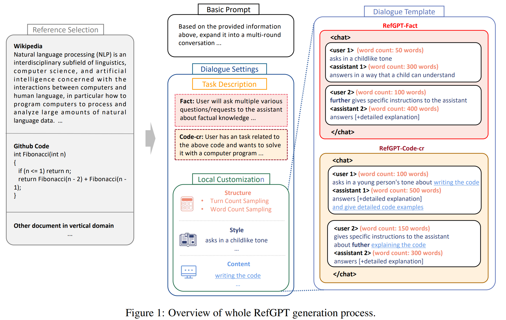
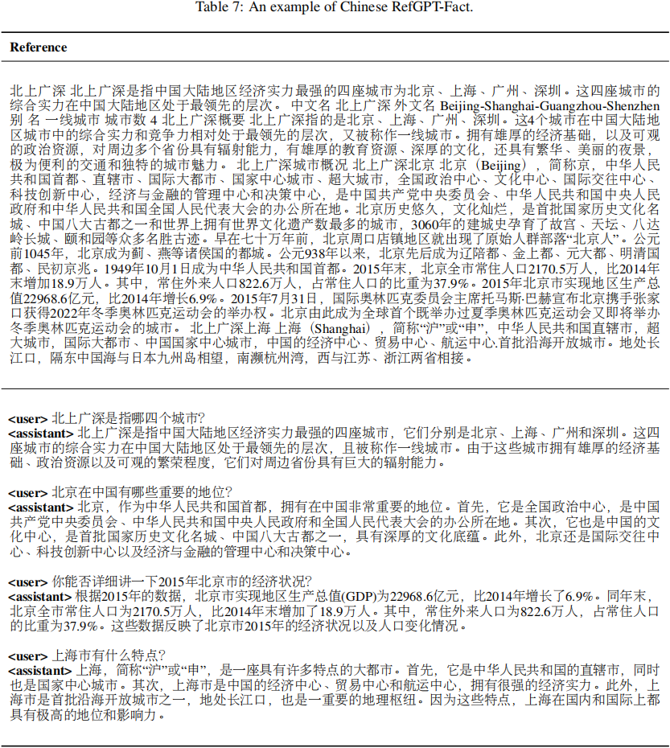
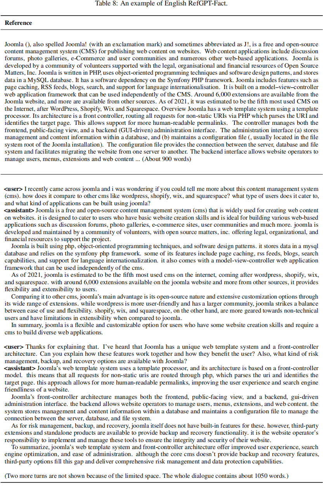
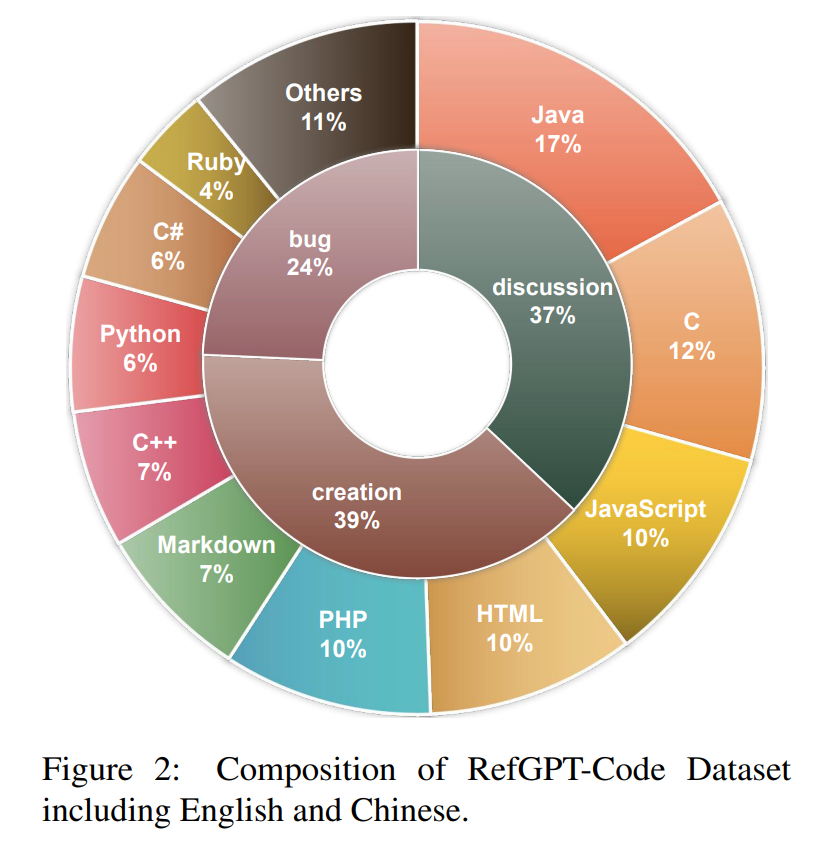
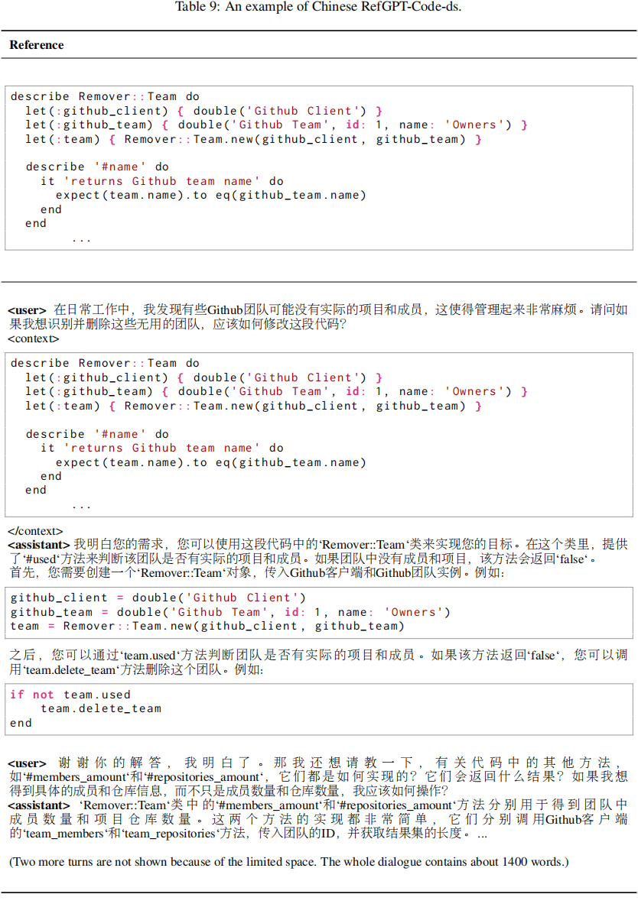
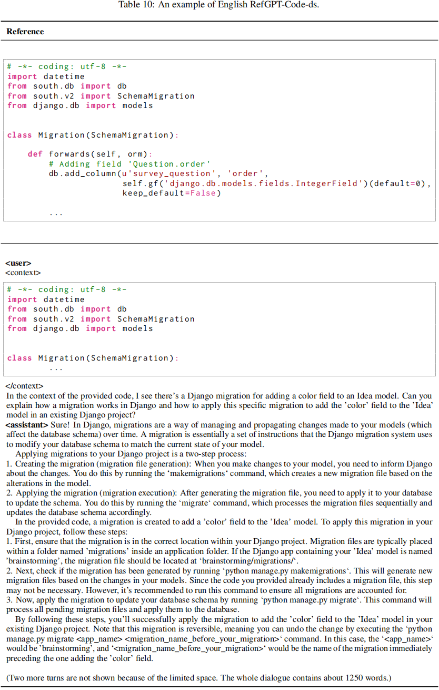
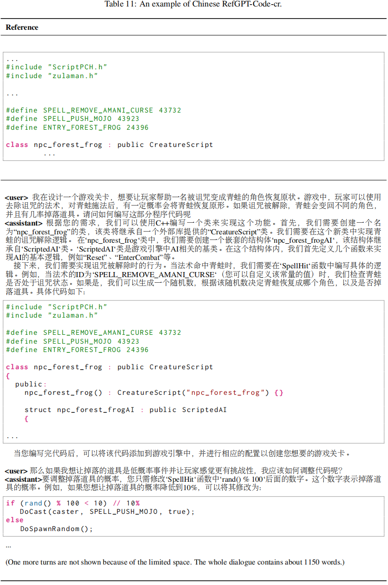
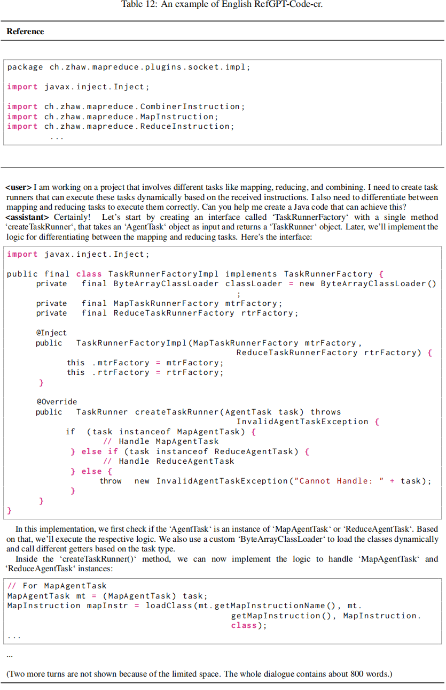
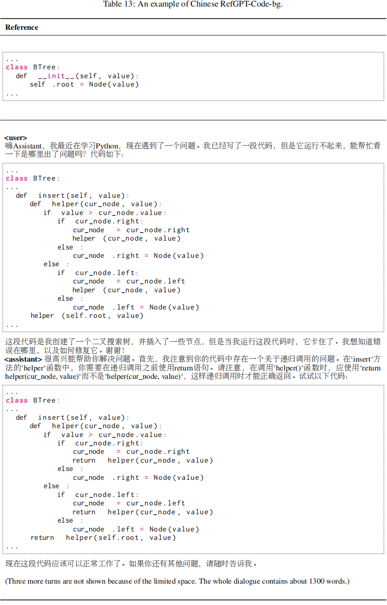
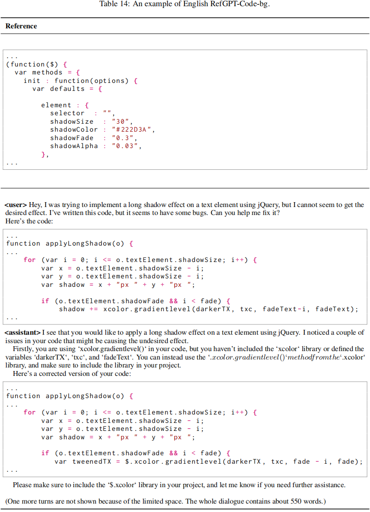

<p align="center">

</p>

<!-- [[中文版](README.md)]
 -->
 <p align="center">
  <a href="https://arxiv.org/abs/2305.14994"><b>[Paper] RefGPT</b></a>
</p>


<p style="text-align:justify; text-justify:inter-ideograph;">
General chat models, like ChatGPT, have attained impressive capability to resolve a wide range of NLP tasks by tuning Large Language Models (LLMs) with high-quality instruction data. However, collecting human-written high-quality data, especially multi-turn dialogues, is expensive and unattainable for most people. Though previous studies have used powerful LLMs to generate the dialogues automatically, but they all suffer from generating untruthful dialogues because of the LLMs hallucination. Therefore, we propose a method called <b>RefGPT</b> to generate enormous truthful and customized dialogues without worrying about factual errors caused by the model hallucination. RefGPT solves the model hallucination in dialogue generation by restricting the LLMs to leverage the given reference instead of reciting their own knowledge to generate dialogues. Additionally, RefGPT adds detailed controls on every utterances to enable highly customization capability, which previous studies have ignored. On the basis of RefGPT, we also propose two high-quality dialogue datasets generated by GPT-4, namely <b>RefGPT-Fact</b> and <b>RefGPT-Code</b>. RefGPT-Fact is 100k multi-turn dialogue datasets based on factual knowledge and RefGPT-Code is 76k multi-turn dialogue dataset covering a wide range of coding scenarios.
</p>

### News
---
- April 15th, we released the initial version of RefGPT-Fact-CN dataset.
- May 25th, we released the paper and annouced the new RefGPT-Fact dataset and the RefGPT-Code dataset.
- May 26th, we released the RefGPT-Fact dataset and the RefGPT-Code dataset on the huggingface hub. <a href="https://huggingface.co/Mutonix"><b>[download]</b></a>
- **Future**: We will release our code recently.

## Proposed Method
<p align="center">

</p>


<!-- Our objective is to automatically generate a vast amount of high-quality multi-turn dialogues withour factual errors using powerful LLMs. We employ the following steps. -->


<!-- ### Reference Selection

### Basic Prompt

### Dialogues settings -->


## Released Datasets

### RefGPT-Fact <a href="https://huggingface.co/datasets/Mutonix/RefGPT-Fact"><b>[download]</b></a>

<p style="text-align:justify; text-justify:inter-ideograph;">
RefGPT-Fact is a datasets containing 100k multi-turn dialogues about factual
knowledge with 50k English and 50k Chinese.
The English version uses the English Wikipedia
as the reference and the Chinese version uses
the frequently-used Chinese online encyclopedia
website, Baidu Baike.
</p>

<p align="center">

</p>

<p align="center">

</p>


### RefGPT-Code [download<a href="https://huggingface.co/datasets/Mutonix/RefGPT-Code-ds"><b>[ds]</b></a><a href="https://huggingface.co/datasets/Mutonix/RefGPT-Code-cr"><b>[cr]</b></a><a href="https://huggingface.co/datasets/Mutonix/RefGPT-Code-bg"><b>[bg]</b></a>]
<p style="text-align:justify; text-justify:inter-ideograph;">
RefGPT-Code is a dataset containing 76k multi-turn dialogues about programming with 37k English and 39k Chinese, which
has covered most aspects of code usage scenarios
and multiple types of programming languages, as
shown in Figure 2. Both the English version and
Chinese version use the public GitHub dataset on
Google BiqQuery with no overlap in these two
languages. RefGPT-Code has derived various ways
of leveraging the program code as the reference
to enable different scenarios. We consider three
perspectives of code discussion, code creation and
bug fixing in RefGPT-Code
</p>
<p align="center">

</p>

#### RefGPT-Code-ds (discussion)
<p align="center">

</p>

<p align="center">

</p>

#### RefGPT-Code-cr (creation)
<p align="center">

</p>

<p align="center">

</p>

#### RefGPT-Code-bg (bug fixing)
<p align="center">

</p>

<p align="center">

</p>

### **Attention**
<p style="text-align:justify; text-justify:inter-ideograph;">
As the datasets RefGPT-Fact and RefGPT-Code are collected by using the references like Wikipedia and Github repositories, it can not be avoided that the reference itself has factual errors, typos, or bugs
and malicious code if it is from Github repositories. The datasets may also reflect the biases of the selected references and GPT-3.5/GPT-4 model

Please pay attention that RefGPT Datasets, including RefGPT-Fact and RefGPT-Code, have not undergone manual verification, and as such, their security cannot be strictly guaranteed. Users should be aware that they are responsible for the results generated using this data.
</p>


<!-- ## FAQ


- Q1: Which websites, e-books, and LLMs do you use? For example, do you use GPT-3.5, GPT-4, or something else?

- A1: Due to potential legal risks, we kindly refrain from answering these questions.

- Q2: The RefGPT-Dataset-V1-CN contains 50,000 samples. Is this the entirety of your data collection, or will you release additional data?

- A2: Our overall data collection for training RefGPT exceeds 50,000 samples. The released dataset is only a subset. We might make more data available in the future.

- Q3: Do you plan to release the QA data generated by RefGPT?

- A3: We will not release the data generated by RefGPT, citing legal risks. However, we may consider releasing RefGPT's checkpoints in the future.

- Q4: The RefGPT-Dataset-V1-CN is a Chinese dataset. Are there plans to release an English dataset?

- A4: Yes, we intend to release RefGPT-Dataset-V1-EN, which will be an English dataset containing 50,000 samples. -->


## Contributors


1. Dongjie Yang, djyang.tony@sjtu.edu.cn
2. [Ruifeng Yuan](http://www4.comp.polyu.edu.hk/~csryuan/), ruifeng.yuan@connect.polyu.hk
3. Yuantao Fan, yuantaofan@bupt.edu.cn
4. Yifei Yang, yifeiyang@sjtu.edu.cn
5. [Zili Wang](https://commencement.github.io/), ziliwang.do@gmail.com
6. [Shusen Wang](http://wangshusen.github.io/), wssatzju@gmail.com
7. [Hai Zhao](https://bcmi.sjtu.edu.cn/~zhaohai/index.ch.html/),zhaohai@cs.sjtu.edu.cn


## Citation

If your work take inspiration from or make use of our method or data, we kindly request that you acknowledge and cite our paper as a reference.


```bibtex
@misc{yang2023refgpt,
      title={RefGPT: Reference -> Truthful & Customized Dialogues Generation by GPTs and for GPTs}, 
      author={Dongjie Yang and Ruifeng Yuan and YuanTao Fan and YiFei Yang and Zili Wang and Shusen Wang and Hai Zhao},
      year={2023},
      eprint={2305.14994},
      archivePrefix={arXiv},
      primaryClass={cs.CL}
}
```


